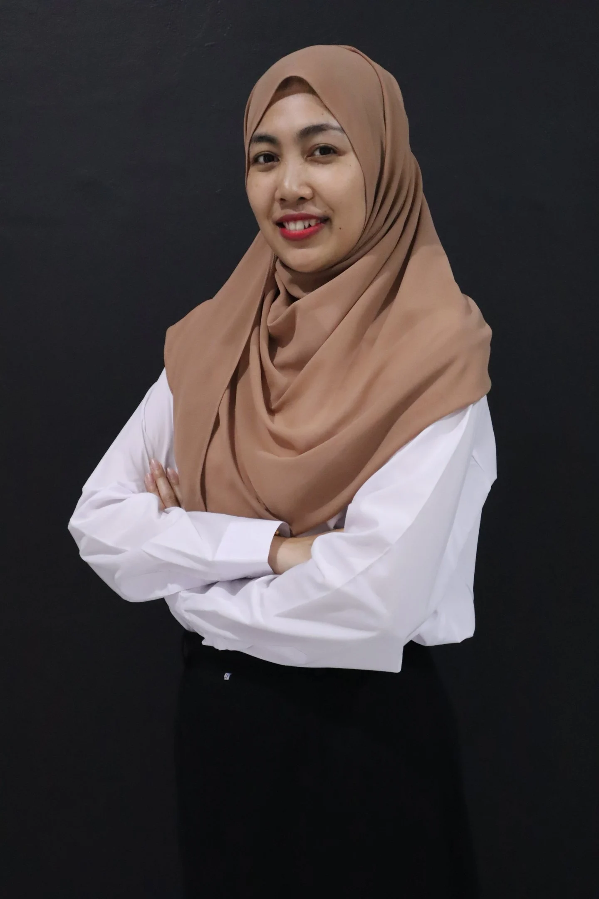
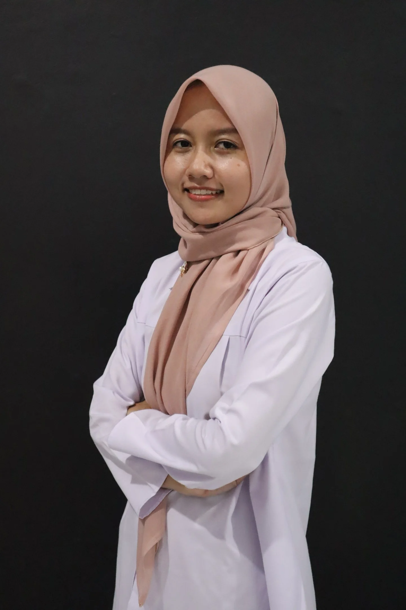
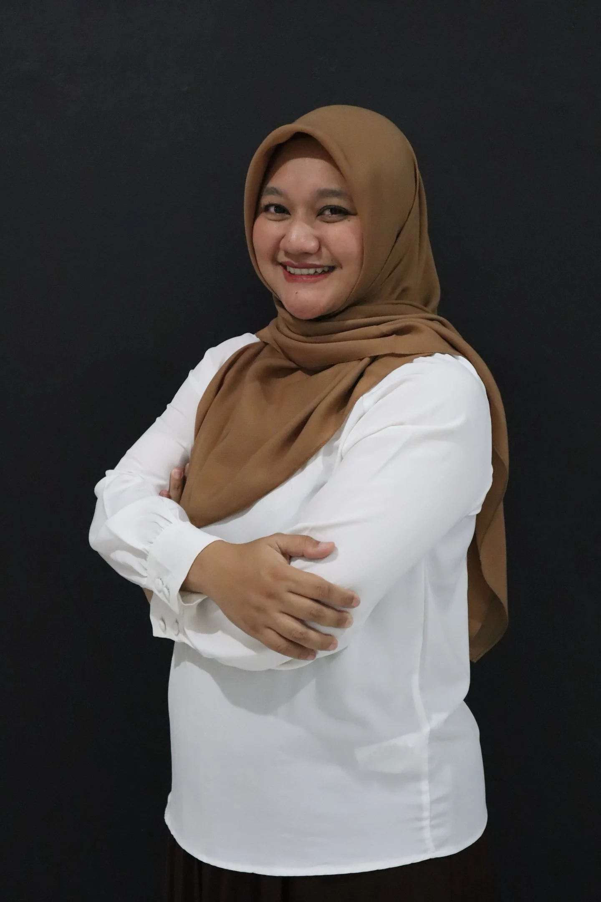
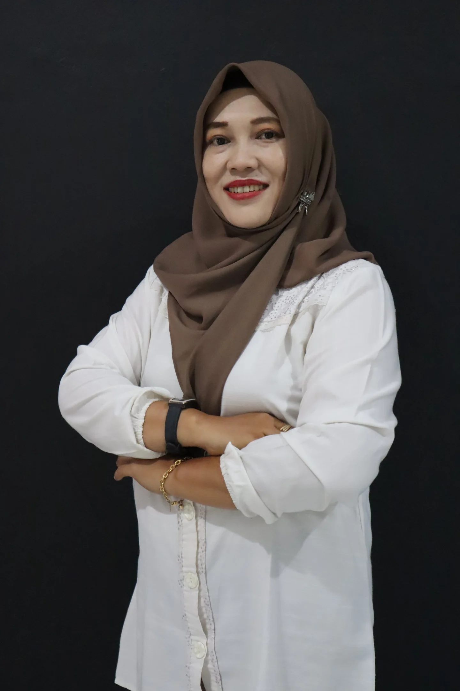

# Bachelor Midwifery Lecturers - Institut Karya Mulia Bangsa

Source: https://bachelor-midwifery.kmb.ac.id/

---

## 1. Rizqitha, S.Tr.Keb., M.Tr.Keb

- **Prodi:** S1 & Profesi Kebidanan
- **NUPTK:** 0608049401
- **Kepakaran:** Asuhan Neonatus, Bayi, Balita, dan Anak Prasekolah
- **Sinta ID:** 6796395
- **Google Scholar:** https://scholar.google.com/citations?user=dHKOQMYAAAAJ&hl=en&oi=ao
- **E-mail:** rizqitha@kmb.ac.id
- **Pendidikan S1:** Kebidanan Poltekkes Semarang
- **Pendidikan S2:** Kebidanan Terapan Poltekkes Semarang
- **Pendidikan S3:** Ongoing DIKK Undip

---

## 2. Rizki Muji Lestari, S.SiT., M.Kes

*(No photo available - placeholder image)*

- **Prodi:** S1 & Profesi Kebidanan
- **NUPTK:** 1124088901
- **Kepakaran:** Kehamilan
- **Sinta ID:** 6023736
- **Google Scholar:** https://scholar.google.com/citations?user=NooTiioAAAAJ&hl=id
- **E-mail:** baraisa18@gmail.com
- **Pendidikan S1:** Bidan Pendidik STIKES Sari Mulia Banjarmasin
- **Pendidikan S2:** Kesehatan Masyarakat Universitas Respati Indonesia
- **Pendidikan S3:** -

---

## 3. Rizqi Dian Pratiwi, S.Tr.Keb., M.Tr.Keb

- **Prodi:** S1 & Profesi Kebidanan
- **NUPTK:** 0616089605
- **Kepakaran:** Kehamilan
- **Sinta ID:** 6909594
- **Google Scholar:** https://scholar.google.com/citations?view_op=list_works&hl=id&user=rvvtEW8AAAAJ
- **E-mail:** rizqidianpratiwi@gmail.com
- **Pendidikan S1:** Kebidanan Poltekkes Semarang
- **Pendidikan S2:** Terapan Kebidanan Poltekkes Kemenkes Semarang
- **Pendidikan S3:** -

---

## 4. Bd. Mariza Mustika Dewi, S.Tr.Keb., M.Tr.Keb

- **Prodi:** S1 & Profesi Kebidanan
- **NUPTK:** 0618039302
- **Kepakaran:** Nifas Menyusui
- **Sinta ID:** 6793188
- **Google Scholar:** https://scholar.google.com/citations?user=sMzeApYAAAAJ&hl=id&oi=ao
- **E-mail:** marizamd@kmb.ac.id
- **Pendidikan S1:** Bidan Pendidik STIKes Karya Husada Semarang
- **Pendidikan S2:** Terapan Kebidanan Poltekkes Kemenkes Semarang
- **Pendidikan S3:** -

---

## 5. Bdn. Sri Mularsih, S.SiT., M.Kes

- **Prodi:** S1 & Profesi Kebidanan
- **NUPTK:** 0618048001
- **Kepakaran:** Kesehatan Reproduksi dan Perencanaan Keluarga
- **Sinta ID:** 6687835
- **Google Scholar:** https://scholar.google.com/citations?user=8OnkCmsAAAAJ&hl=id
- **E-mail:** sri@kmb.ac.id
- **Pendidikan S1:** Bidan Pendidik UNW
- **Pendidikan S2:** Promosi Kesehatan Konsentrasi Kesehatan Reproduksi dan HIV/AIDS FKM UNDIP
- **Pendidikan S3:** -

---

## 6. Bdn. Lia Ayu Kusumaningrum, S.ST., M.Tr.Keb

*(No photo available - placeholder image)*

- **Prodi:** S1 & Profesi Kebidanan
- **NUPTK:** 9990626978
- **Kepakaran:** Kehamilan, Kespro
- **Sinta ID:** -
- **Google Scholar:** -
- **E-mail:** chindriaqilla@gmail.com
- **Pendidikan S1:** Bidan Pendidik STIKES `Aisyiyah Yogyakarta
- **Pendidikan S2:** Terapan Kebidanan STIKES Guna Bangsa Yogyakarta
- **Pendidikan S3:** -

---

## 7. Endah Wijayanti, S.SiT., M.Kes

*(No photo available - placeholder image)*

- **Prodi:** S1 & Profesi Kebidanan
- **NUPTK:** 0601097901
- **Kepakaran:** -
- **Sinta ID:** -
- **Google Scholar:** -
- **E-mail:** -
- **Pendidikan S1:** -
- **Pendidikan S2:** -
- **Pendidikan S3:** -

---
