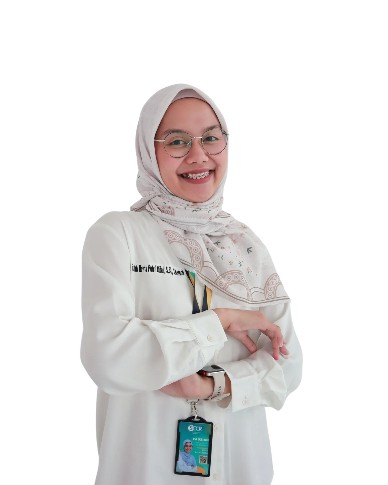
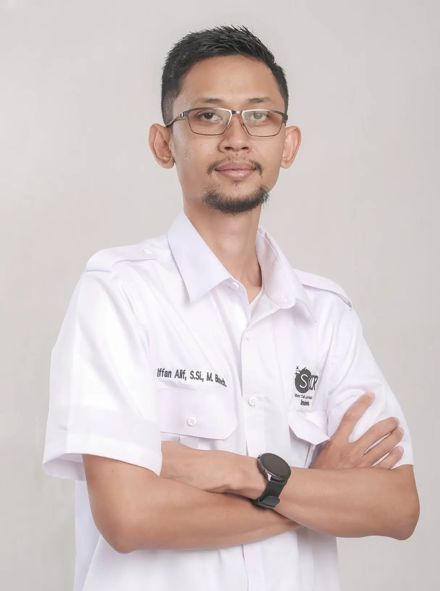
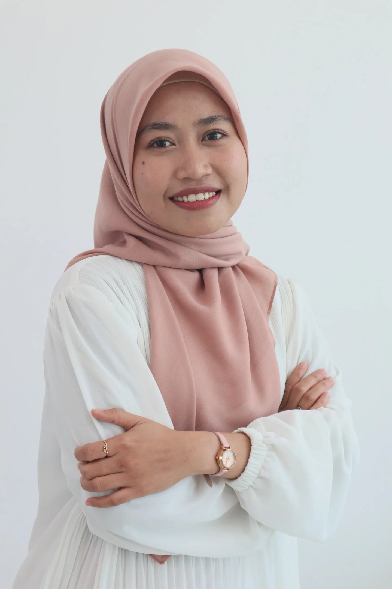
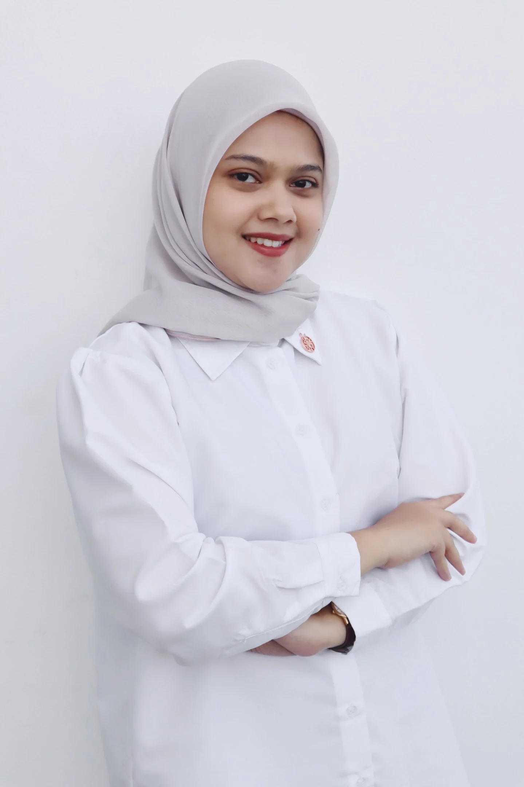
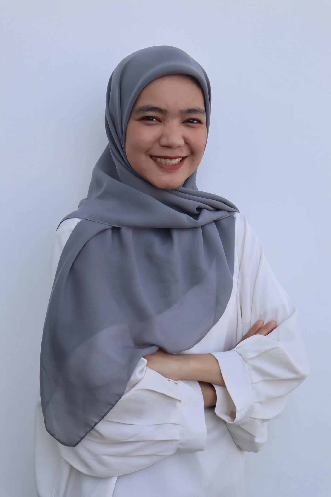

# Biotechnology Lecturers - Institut Karya Mulia Bangsa

Source: https://biotechnology.kmb.ac.id/

---

## 1. Fauziah Novita Putri Rifai, S.Si, M.Biotech

- **Prodi:** Bioteknologi
- **NUPTK:** 5438774675230243
- **Kepakaran:** Cancer Drug Discovery and Delivery
- **Sinta ID:** 6933501
- **Google Scholar:** https://scholar.google.com/citations?hl=en&user=1UJe3asAAAAJ
- **E-mail:** FauziahNovita@kmb.ac.id
- **Pendidikan S1:** Biologi
- **Pendidikan S2:** Bioteknologi
- **Pendidikan S3:** -

---

## 2. Iffan Alif, S.Si, M.Biotech

- **Prodi:** Bioteknologi
- **NUPTK:** 5454772673130273
- **Kepakaran:** Cancer Stem Cell
- **Sinta ID:** 6933499
- **Google Scholar:** https://scholar.google.com/citations?user=3djlgEEAAAAJ&hl=en&oi=sra
- **E-mail:** IffanAlif@kmb.ac.id
- **Pendidikan S1:** Biologi
- **Pendidikan S2:** Bioteknologi
- **Pendidikan S3:** On going S3 Bioteknologi UGM

---

## 3. Nurul Hidayah, S.Si, M.Biotech

- **Prodi:** Bioteknologi
- **NUPTK:** 6960774675230252
- **Kepakaran:** Cancer Engineering
- **Sinta ID:** 6933664
- **Google Scholar:** https://scholar.google.com/citations?user=hGchFnoAAAAJ&hl=en&oi=sra
- **E-mail:** NurulHidayah@kmb.ac.id
- **Pendidikan S1:** Biologi
- **Pendidikan S2:** Bioteknologi
- **Pendidikan S3:** -

---

## 4. Salindri Prawitasari, S.Si, M.Si.

- **Prodi:** Bioteknologi
- **NUPTK:** 9659774675230242
- **Kepakaran:** Stem Cell
- **Sinta ID:** 6933436
- **Google Scholar:** https://scholar.google.com/citations?hl=en&user=kRILrrwAAAAJ
- **E-mail:** SalindriPrawitasari@kmb.ac.id
- **Pendidikan S1:** Biologi
- **Pendidikan S2:** Bioteknologi
- **Pendidikan S3:** -

---

## 5. Dini Cahyani, S.Si, M.Biotech

- **Prodi:** Bioteknologi
- **NUPTK:** 8237775676230193
- **Kepakaran:** Virology
- **Sinta ID:** 6931365
- **Google Scholar:** https://scholar.google.com/citations?hl=en&user=8lhVAWkAAAAJ
- **E-mail:** DiniCahyani@kmb.ac.id
- **Pendidikan S1:** Biologi
- **Pendidikan S2:** Bioteknologi
- **Pendidikan S3:** -

---
